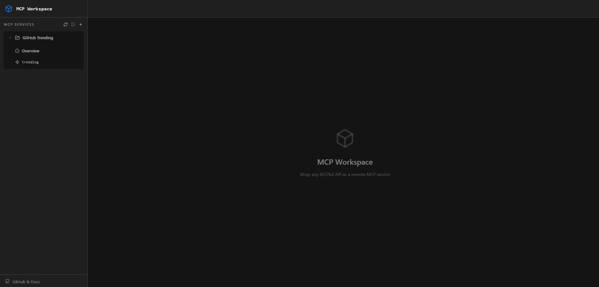
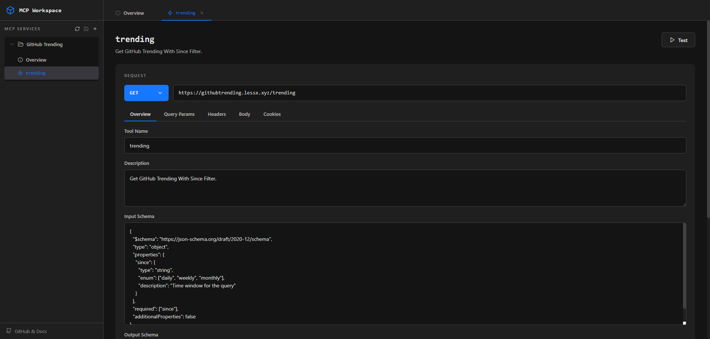
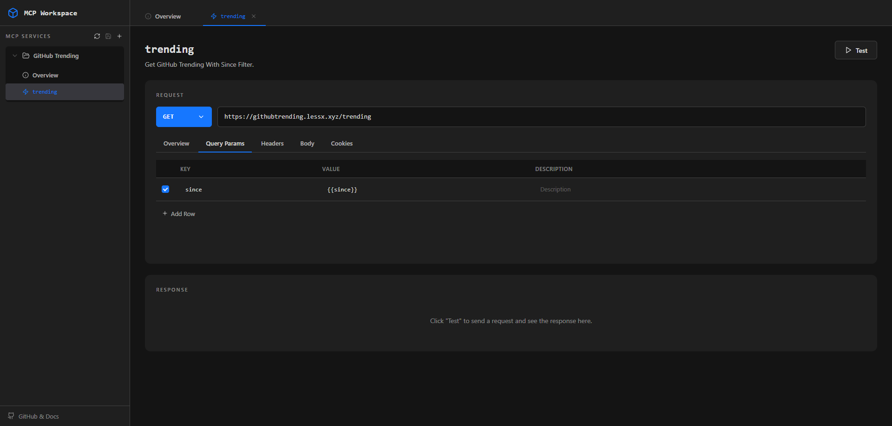
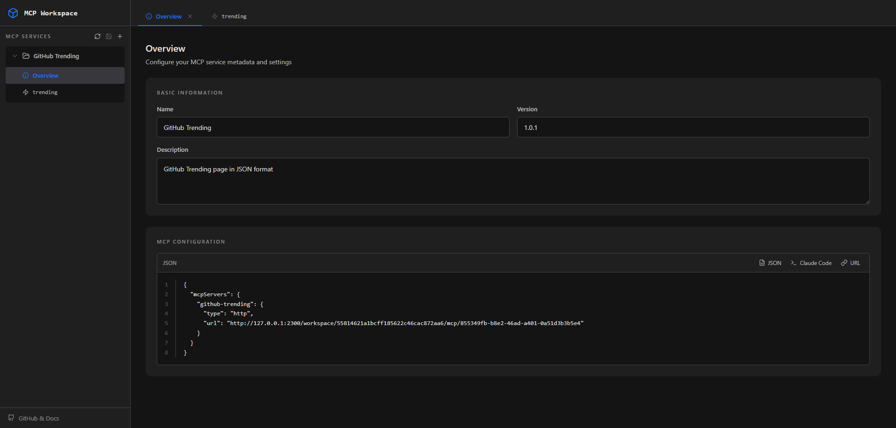

# MCP Workspace

<p align="center">
  
</p>

<p align="center">
  <strong>Convert any REST API into a Model Context Protocol (MCP) service — no coding required.</strong>
</p>

<p align="center">
  <a href="#design-philosophy">Design Philosophy</a> •
  <a href="#security-notice">Security</a> •
  <a href="#try-it-out">Try It Out</a> •
  <a href="#quick-start">Quick Start</a> •
  <a href="#deployment">Deployment</a>
</p>

---

## What is MCP Workspace?

**MCP Workspace** is a visual configuration platform that transforms existing RESTful APIs into standardized [Model Context Protocol (MCP)](https://modelcontextprotocol.io/) services. It serves as a bridge between your APIs and AI assistants like Claude, enabling them to interact with your services through a unified protocol.

<!-- TODO: Add screenshot of the main interface -->


### Why MCP Workspace?

- **No Code Required**: Configure API-to-MCP mappings through an intuitive web interface
- **Instant Integration**: Your REST APIs become immediately available as MCP tools
- **Visual Testing**: Test API configurations before deployment with built-in verification
- **Flexible Deployment**: Self-host or deploy to Cloudflare Workers with one click

## Design Philosophy

### Local-First, Personal-First, Ease-of-Use First

MCP Workspace is designed with simplicity in mind:

- **No Login Required**: Start using immediately without creating an account
- **Self-Hosted**: Deploy on your local machine or Cloudflare Workers — you own your data
- **Personal AI Toolkit**: Build your own collection of MCP-wrapped APIs as AI assistant tools

### Bridging the MCP Gap

Many companies provide excellent APIs but haven't yet embraced the AI era with official MCP support. MCP Workspace serves as:

- **A Stopgap Solution**: Use it while waiting for official MCP services from API providers
- **A Reference Implementation**: Shows companies how to quickly expose their existing APIs as MCP services without building dedicated MCP infrastructure
- **A Unified Approach**: Companies don't need to maintain separate MCP services and REST APIs — wrap once, serve both

## Security Notice

> **This project was built entirely through Vibe Coding and has not undergone rigorous security testing.**

### Important Security Considerations

1. **Don't Share Your Browser URL**
   - Anyone with your workspace URL has full management access
   - The browser URL contains your workspace ID which grants edit permissions

2. **MCP URLs Are Safe to Share**
   - Generated MCP endpoint URLs use a hashed workspace ID
   - Others cannot reverse-engineer your management URL from the MCP URL

3. **Sensitive Credentials**
   - If your MCP configurations contain API keys or secrets, **deploy locally only**
   - Avoid storing sensitive credentials in cloud-deployed instances

## Try It Out

New to MCP Workspace? Try wrapping the **GitHub Trending API** as your first MCP service:

👉 **[github.com/larryteal/githubtrending](https://github.com/larryteal/githubtrending)**

This project provides a JSON API for GitHub Trending data and has been verified to work with MCP Workspace. It's a great way to practice and get familiar with the platform before wrapping your own APIs.

## Features

### Visual API Configuration
Configure HTTP methods, headers, query parameters, request bodies, and cookies
<!-- TODO: Add screenshot of tool configuration -->

  


### Dynamic Input Schema
Define input parameters with JSON Schema. Template variables (`{{varName}}`) are automatically substituted at runtime.

### Real-time API Testing
Verify whether an API can be called successfully before saving it as an MCP service.
This is necessary because some APIs block access from cloud IPs. During verification, make sure to use concrete values instead of template variables.

### MCP-Ready Output
Generate MCP server configurations compatible with Claude Code and other MCP clients.

<!-- TODO: Add screenshot of MCP config output -->


## Quick Start

### Prerequisites

- Node.js
- pnpm

### Local Development

```bash
# Clone the repository
git clone https://github.com/larryteal/mcp-workspace.git
cd mcp-workspace

# Install dependencies
cd frontend && pnpm install
cd ../backend && pnpm install

# Initialize the database
cd backend && npx wrangler d1 migrations apply DB --local

# Start development servers (in separate terminals)
cd frontend && pnpm dev    # Frontend on http://localhost:5173
cd backend && pnpm dev     # Backend on http://localhost:2300
```

## Usage

### 1. Create an MCP Service

Click the **"+"** button in the sidebar to create a new MCP service. Give it a name and description.

### 2. Add Tools

Each tool maps to a REST API endpoint. Configure:

- **Name**: Tool identifier used by AI assistants
- **Description**: Helps AI understand when to use this tool
- **HTTP Method**: GET, POST, PUT, DELETE, etc.
- **URL**: The API endpoint
- **Parameters**: Query params, headers, cookies, and request body (Supports {{variables}}. Template variables must be defined as properties in the Input Schema.)

### 3. Define Input Schema

Specify the input parameters your tool accepts using JSON Schema,
The parameters defined in the Input Schema will be provided by the MCP client when invoking the tool.

```json
{
  "$schema": "https://json-schema.org/draft/2020-12/schema",
  "type": "object",
  "properties": {
    "since": {
      "type": "string",
      "enum": ["daily", "weekly", "monthly"],
      "description": "Time window for the query"
    }
  },
  "required": ["since"],
  "additionalProperties": false
}
```

### 4. Test Your Configuration

Use the **Test** button to verify your API configuration works correctly.

### 5. Get MCP Config

Copy the generated MCP configuration and add it to your MCP Client config file:

```json
{
  "mcpServers": {
    "my-service": {
      "type": "http",
      "url": "https://{domain}/workspace/{hash}/mcp/{serviceId}"
    }
  }
}
```

## Deployment

### Cloudflare Workers (Recommended)

Both frontend and backend are designed for Cloudflare Workers deployment:

```bash

# Deploy backend
# Replace {env} with staging or production (Check the scripts defined in package.json)
# Replace database_id in wrangler.jsonc with the actual D1 database ID
cd backend && npx wrangler d1 migrations apply DB --remote --env {env} && pnpm run deploy:{env}

# Deploy frontend
cd frontend && pnpm run deploy:{env}
```

### Environment Variables

Create `.env.production` in the frontend directory:

```env
VITE_MCP_API_BASE_URL=https://{domain}
```

## Tech Stack

### Frontend
- React 19 with TypeScript
- Ant Design 6 (Dark Mode)
- Vite
- Cloudflare Pages

### Backend
- Hono (Web Framework)
- Cloudflare Workers + D1 (SQLite)
- MCP SDK (`@modelcontextprotocol/sdk`, `agents/mcp`)
- Zod (Validation)

## Project Structure

```
mcp-workspace/
├── frontend/          # React management interface
│   ├── src/
│   │   ├── components/   # UI components
│   │   ├── context/      # React contexts
│   │   ├── pages/        # Page components
│   │   └── services/     # API services
│   └── index.html
├── backend/           # Hono API server
│   ├── src/
│   │   ├── routes/       # API routes
│   │   └── utils/        # Utilities
│   └── migrations/       # D1 migrations
└── design/            # UI design files
```

## License

[MIT License](LICENSE)

---

<p align="center">
  Built with the <a href="https://modelcontextprotocol.io/">Model Context Protocol</a>
</p>
